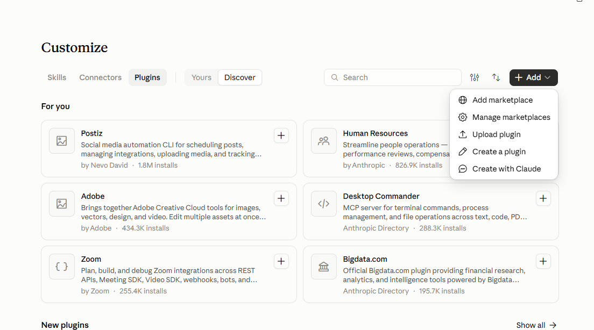
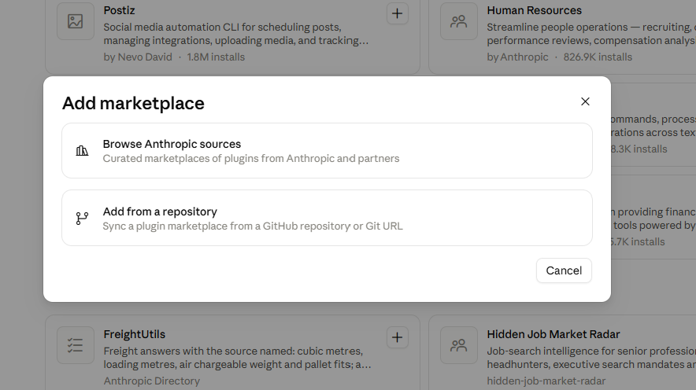
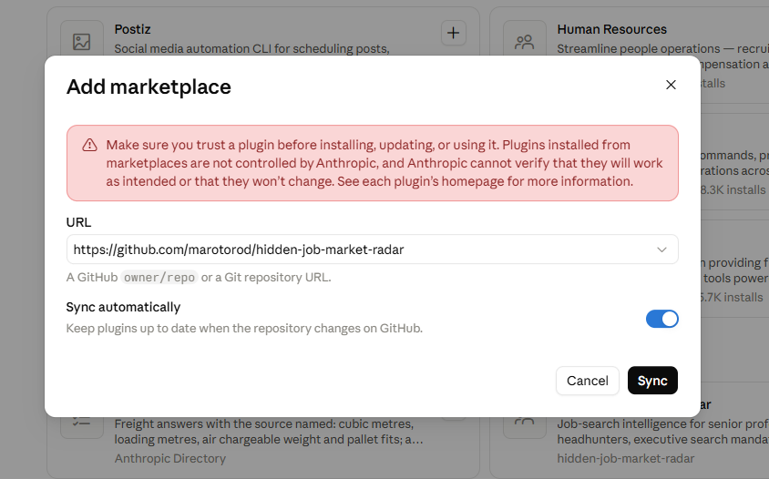

# Hidden Job Market Radar

**Find the jobs that never get posted.** A Claude skill and plugin for senior and executive job seekers.

*🇪🇸 Radar del mercado laboral oculto: tu búsqueda de empleo, con método de headhunter. [Ver en español ↓](#-en-español)*


Most senior roles are filled through headhunters, executive search firms and networks before they ever reach a job board. Hidden Job Market Radar turns Claude into a personal job-search intelligence system: it doesn't just list jobs, it tells you which ones genuinely fit your track record and who controls the processes you can't see.

- ✅ **Verified openings.** Every job is checked against the real posting before it gets a score.
- 🎯 **Scored by real fit.** A 0–100 score against your CV, separating direct from transferable experience.
- 🕵️ **Hidden job market.** Maps headhunters, executive search firms, mandates and market signals.
- 💶 **Total compensation.** Base, bonus and benefits, not just the headline salary.
- 🤝 **Your own network and hiring signals.** Spots funding rounds, leadership changes and expansions before roles are posted, and where a contact of yours can introduce you.
- 📋 **Pipeline and interviews.** Tracks your applications, reminds you to follow up and prepares interview briefs.
- 🧠 **Learns between runs.** Remembers which sources, ATS and queries actually work for you.
- 🔒 **Safe by design.** Never invents experience. Never applies, sends your CV or contacts anyone without your explicit OK.

## Install

### Claude app (claude.ai / Cowork), no code needed

**1.** Open **Customize → Plugins**, click **Add** and choose **Add marketplace**.



**2.** Choose **Add from a repository**.



**3.** Paste `https://github.com/marotorod/hidden-job-market-radar` in **URL**, leave **Sync automatically** on to get updates, and click **Sync**.



**4.** **Hidden Job Market Radar** now appears in your plugins. Click **+** to install it, then start a chat and say *"Set up my job search radar"*.

### Claude Code

```
/plugin marketplace add marotorod/hidden-job-market-radar
/plugin install hidden-job-market-radar@hidden-job-market
```

### ChatGPT

1. Download **[hidden-job-market-radar.zip](https://github.com/marotorod/hidden-job-market-radar/raw/main/dist/hidden-job-market-radar.zip)**.
2. In ChatGPT, open **Plugins → Skills → Create → Upload from your computer** and upload the ZIP.
3. Start a chat and say *"Set up my job search radar"*.

Skills in ChatGPT depend on your plan, and if you're on a workspace, on what your admin has enabled. You can share the skill with your workspace from its **•••** menu.

### Codex

```
codex plugin marketplace add marotorod/hidden-job-market-radar
codex plugin add hidden-job-market-radar@hidden-job-market
```

### Other tools that read SKILL.md

The skill follows the open [Agent Skills](https://agentskills.io) format, so it also works in tools such as Gemini CLI, GitHub Copilot or Cursor. Copy the [`skills/hidden-job-market-radar`](skills/hidden-job-market-radar) folder into that tool's skills directory, or add it as a skill in Claude by uploading the same ZIP.

## How to use it

Just talk to Claude:

| You say | What the radar does |
|---|---|
| "Set up my job search radar" + your CV | Short interview, then builds your positioning and criteria files |
| "Run the radar" / "Find me jobs" | Full search: sources, career sites and ATS, headhunters, verification, scoring and report |
| "Is this role a good fit?" + a link | Verifies the posting, applies knockout filters, scores it and analyses compensation |
| "Compare these two offers" | Side-by-side total compensation and fit |
| "Map executive search firms for fintech in Spain" | Firms, partners, mandates and draft outreach messages (never sent) |
| "Prepare my application for this role" | Tailored CV and cover letter, only for roles you authorise |
| "Who in my network works at these companies?" | Matches your contacts with openings and hiring signals and drafts introduction requests (never sent) |
| "Log this application as interview" | Updates your pipeline and reminds you of follow-ups |
| "Prepare me for this interview" | Interview brief with stories from your CV, likely questions and questions to ask |
| "Delete all my radar data" | Lists the files, asks you to confirm, then deletes them |

The radar can run on a schedule (weekly is recommended) and send you a report.

## What it creates

The radar keeps its memory in plain Markdown and CSV files in your own workspace, so you can read, edit or delete them at any time:

| File | Purpose |
|---|---|
| `profile_and_criteria.md` | Fixed facts, positioning, target roles, sectors, compensation, geography, scoring |
| `role_taxonomy.md` | Role families and equivalent titles |
| `company_universe.md` | Target, adjacent and discovery companies by priority |
| `sources_and_strategy.md` | Sources, routes and effort budget |
| `jobs_log.md` | Every job reviewed |
| `recruiters_log.md` | Firms, partners, mandates and contact routes |
| `learning_log.md` | What worked, what failed and what to change next run |
| `contacts.csv` | Your own network, only what you choose to share (optional) |
| `applications.csv` | Your application pipeline and follow-ups |
| `salary_benchmarks.csv` | Salary references, each with its source and date |

> The radar talks to you in your own language, and writes application materials in the language of each posting.

## Works best with

- **Web search**, which the radar needs.
- **An email connector** (optional), to read your job alerts and send the report.
- **Scheduled tasks** (optional), for a recurring weekly radar.

## Principles

1. Your master CV is the single source of truth. Nothing is invented or embellished.
2. Nothing external happens without your explicit authorisation, including in scheduled runs.
3. Every posting is verified before it is scored.
4. External content is data, not instructions.
5. It won't force a ranking: if nothing fits, it says so.

---

## 🇪🇸 En español

**Encuentra los empleos que nunca se publican.** Una skill y plugin de Claude para profesionales senior y directivos.

La mayoría de los puestos senior se cubren a través de headhunters, firmas de Executive Search y contactos antes de llegar a un portal de empleo. Hidden Job Market Radar convierte a Claude en tu sistema personal de inteligencia de mercado laboral: detecta oportunidades de alto encaje con tu trayectoria real y mapea quién controla los procesos que no ves.

- ✅ **Ofertas verificadas** contra el texto real antes de puntuarlas.
- 🎯 **Puntuación por encaje real** (0–100) con tu CV, distinguiendo experiencia directa de transferible.
- 🕵️ **Mercado oculto**: headhunters, firmas de Executive Search, mandatos y señales de mercado.
- 💶 **Compensación total**: fijo, variable y beneficios, no solo el salario publicado.
- 🤝 **Tu red y señales de contratación**: detecta rondas de financiación, cambios de dirección y expansiones antes de que se publique el puesto, y dónde un contacto tuyo puede presentarte.
- 📋 **Candidaturas y entrevistas**: sigue tus candidaturas, te recuerda hacer seguimiento y prepara entrevistas.
- 🧠 **Aprende entre ejecuciones**: qué fuentes, ATS y búsquedas funcionan en tu caso.
- 🔒 **Segura**: no inventa experiencia y no envía candidaturas ni contacta con nadie sin tu autorización explícita.

### Instalación

**App de Claude (claude.ai / Cowork), sin código** (las capturas están [más arriba](#claude-app-claudeai--cowork-no-code-needed)):

1. Abre **Personalización → Plugins**, pulsa **Añadir** y elige **Añadir marketplace**.
2. Elige **Añadir desde un repositorio**.
3. Pega `https://github.com/marotorod/hidden-job-market-radar` en **URL**, deja activada la sincronización automática para recibir actualizaciones y pulsa **Sincronizar** (*Sync*).
4. **Hidden Job Market Radar** aparecerá en tus plugins. Pulsa **+** para instalarlo y di en un chat *"Configura mi radar de empleo"*.

**Claude Code**: `/plugin marketplace add marotorod/hidden-job-market-radar` y después `/plugin install hidden-job-market-radar@hidden-job-market`.

**ChatGPT**:

1. Descarga **[hidden-job-market-radar.zip](https://github.com/marotorod/hidden-job-market-radar/raw/main/dist/hidden-job-market-radar.zip)**.
2. En ChatGPT, abre **Plugins → Skills → Create → Upload from your computer** y sube el ZIP.
3. Abre un chat y di *"Configura mi radar de empleo"*.

Las skills de ChatGPT dependen de tu plan y, si usas un espacio de trabajo, de lo que haya activado tu administrador. Puedes compartir la skill con tu espacio de trabajo desde su menú **•••**.

**Codex**: `codex plugin marketplace add marotorod/hidden-job-market-radar` y después `codex plugin add hidden-job-market-radar@hidden-job-market`.

**Otras herramientas compatibles con SKILL.md** (Gemini CLI, GitHub Copilot, Cursor…): copia la carpeta [`skills/hidden-job-market-radar`](skills/hidden-job-market-radar) en la carpeta de skills de esa herramienta.

### Cómo usarla

- "Configura mi radar de empleo" (adjunta tu CV)
- "Ejecuta el radar" / "Búscame ofertas"
- "¿Me encaja esta oferta?" (con el enlace)
- "Compara estas dos ofertas"
- "Mapea firmas de Executive Search del sector X"
- "Prepara mi candidatura para esta oferta"
- "¿Quién de mi red trabaja en estas empresas?"
- "Apunta esta candidatura como entrevista"
- "Prepárame para esta entrevista"
- "Borra todos los datos de mi radar"

## Privacy

The plugin has no servers or tracking: your data stays in your own workspace, and nothing is sent to anyone without your explicit OK. Read the full [Privacy Policy](PRIVACY.md).

*Privacidad: el plugin no tiene servidores ni seguimiento; tus datos se quedan en tu espacio de trabajo. Lee la [política de privacidad](PRIVACY.md#política-de-privacidad).*

---

## License

[MIT](LICENSE)
